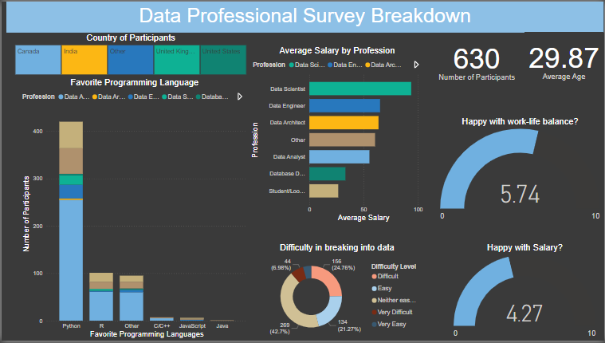

# Power BI Project: Data Domain Analysis
## Table of Contents
- [Visualization](#visualization)
- [Introduction](#introduction)
- [Data Sources](#data-sources)
- [Project Objectives](#project-objectives)
- [Data Preparation](#data-preparation)
- [Data Modeling](#data-modeling)
- [Insights and Analysis](#insights-and-analysis)
- [Conclusion](#conclusion)
- [Future Work](#future-work)
- [How to Use](#how-to-use)
- [Contributing](#contributing)
- [License](#license)
## Visualization
### Sample Visualization

*Figure 1: Overview of the Power BI Dashboard*

### Dashboard Overview

The dashboard visualizes various aspects of the data domain and includes the following components:

1. **Country of Participants**: A bar chart showing the distribution of participants by country.
2. **Favorite Programming Language**: A stacked bar chart illustrating the favorite programming languages among participants.
3. **Average Salary by Profession**: A bar chart showing the average salary for different professional roles.
4. **Number of Participants and Average Age**: Key metrics summarizing the total number of participants and their average age.
5. **Satisfaction with Work-Life Balance**: A gauge showing the average rating for work-life balance satisfaction.
6. **Difficulty in Breaking into Data**: A donut chart displaying the distribution of difficulty levels experienced by participants in breaking into the data domain.
7. **Satisfaction with Salary**: A gauge showing the average rating for salary satisfaction.

## Introduction

This Power BI project analyzes data collected from professionals working in the data domain. The objective is to provide comprehensive insights into various aspects such as demographics, job roles, skills, and trends within the data industry. The analysis is visualized in an interactive Power BI dashboard.

## Data Sources

The data for this project was sourced from a survey dataset named `data_professional_survey_breakdown`. The dataset includes information about:

- Participants' demographics
- Professional roles
- Favorite programming languages
- Salary information
- Work-life balance satisfaction
- Difficulty in breaking into the data domain

## Project Objectives

The main objectives of this project are:

1. **Demographic Analysis**: Understand the distribution of data professionals based on age, gender, location, and educational background.
2. **Job Role Analysis**: Analyze the different roles within the data domain and their respective responsibilities.
3. **Skills Assessment**: Identify the most common and in-demand skills among data professionals.
4. **Trend Analysis**: Determine current trends in the data industry, including emerging technologies and tools.

## Data Preparation

### Data Cleaning

- **Handling Missing Values**: Used mean/median imputation for numerical data and mode imputation for categorical data where applicable.
- **Duplicate Records**: Removed duplicate records to ensure data integrity.
- **Normalization**: Standardized data formats for dates, numerical values, and categorical labels to ensure consistency.

### Data Transformation

- **Encoding**: Converted categorical variables into numerical formats using one-hot encoding and label encoding for analysis.
- **Aggregation**: Aggregated data at different levels (e.g., country-level, role-level) for comprehensive analysis.

## Data Modeling

### Relationships

Created relationships between different tables to enable comprehensive analysis. Key tables include:

- **Demographics Table**: Contains information about age, gender, location, and education.
- **Roles Table**: Details about various job roles and their descriptions.
- **Skills Table**: Information on skills possessed by data professionals and their proficiency levels.

### Measures and Calculations

- **Calculated Columns**: Created new columns for derived metrics such as experience level and skill index.
- **DAX Measures**: Implemented DAX measures to calculate aggregate statistics, such as average salary by role and skill frequency.

## Insights and Analysis

- **Demographic Insights**: The majority of data professionals are from India and the United States, with a balanced representation across other regions.
- **Role Insights**: Data Scientists and Data Engineers report the highest average salaries.
- **Skill Insights**: Python is the most popular programming language among data professionals, followed by R and SQL.
- **Satisfaction Insights**: Participants generally report moderate satisfaction with work-life balance and salary.

## Conclusion

This Power BI project provides a detailed analysis of the data domain, offering valuable insights into demographics, job roles, skills, and industry trends. The interactive dashboard serves as a comprehensive resource for understanding the current state and future direction of the data industry.

## Future Work

- **Expand Data Sources**: Include more data from diverse geographic regions and industries to enhance the analysis.
- **Deeper Analysis**: Conduct deeper analysis on specific roles or skills, such as data visualization experts or big data technologies.
- **Real-Time Dashboards**: Implement real-time data updates for more dynamic and up-to-date insights.

## How to Use

1. **Clone the Repository**: `git clone https://github.com/tanvirtanmoy/data_domain_with_power_BI.git`
2. **Open Power BI**: Open the Power BI Desktop application.
3. **Load the Project**: Open the `.pbix` file from the cloned repository.
4. **Explore Dashboards**: Navigate through the different dashboards to explore the visualizations and insights.

## Contributing

We welcome contributions to improve this project. Please follow these steps:

1. Fork the repository.
2. Create a new branch: `git checkout -b feature/your-feature-name`
3. Make your changes and commit them: `git commit -m 'Add some feature'`
4. Push to the branch: `git push origin feature/your-feature-name`
5. Submit a pull request.

## License

This project is licensed under the MIT License. See the [LICENSE](LICENSE) file for details.

